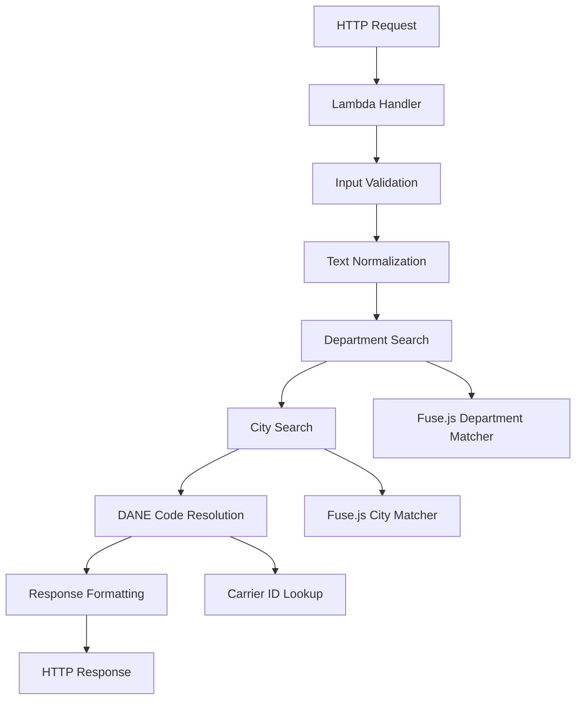

# Design Document

## Overview

The DANE Code Lookup feature implements a fuzzy search system for Colombian geographical data using Fuse.js. The system normalizes input data, performs hierarchical searches (department first, then city), and returns structured results with proper error handling and fallback mechanisms.

## Architecture

The solution follows a layered architecture:

1. **Handler Layer**: AWS Lambda entry point that processes HTTP requests
2. **Service Layer**: Core business logic for DANE code lookup
3. **Data Layer**: Colombian DANE codes data structure
4. **Utility Layer**: Text normalization and fuzzy matching utilities



## Components and Interfaces

### 1. Lambda Handler (`index.ts`)

**Purpose**: Entry point for AWS Lambda function
**Responsibilities**:
- Parse HTTP request body
- Validate input parameters
- Invoke DANE lookup service
- Format HTTP response
- Handle errors and exceptions

```typescript
interface LambdaEvent {
  body: string;
  // other AWS Lambda event properties
}

interface RequestBody {
  department: string;
  city: string;
  idCarrier?: number;
}

interface LambdaResponse {
  statusCode: number;
  body: string;
}
```

### 2. DANE Lookup Service

**Purpose**: Core business logic for geographical data lookup
**Responsibilities**:
- Normalize input text
- Perform fuzzy department search
- Perform fuzzy city search within found department
- Resolve DANE codes with carrier fallback
- Format response data

```typescript
interface DaneLookupService {
  findDaneCode(department: string, city: string, idCarrier?: number): DaneLookupResult;
}

interface DaneLookupResult {
  message: string;
  data: DaneData | null;
}

interface DaneData {
  department: string;
  city: string;
  daneCode: string;
}
```

### 3. Text Normalization Utility

**Purpose**: Standardize text for consistent matching
**Responsibilities**:
- Remove accents and special characters
- Convert to lowercase
- Trim whitespace
- Handle comma-separated values

```typescript
interface TextNormalizer {
  normalize(text: string): string;
  extractFirstPart(text: string): string; // for "medellin, antioquia" -> "medellin"
}
```

### 4. Fuzzy Matcher

**Purpose**: Implement fuzzy search using Fuse.js
**Responsibilities**:
- Configure Fuse.js instances for departments and cities
- Perform similarity searches
- Apply threshold filtering

```typescript
interface FuzzyMatcher {
  searchDepartment(query: string): DepartmentMatch | null;
  searchCity(query: string, department: DepartmentData): CityMatch | null;
}

interface DepartmentMatch {
  department: DepartmentData;
  score: number;
}

interface CityMatch {
  city: CityData;
  score: number;
}
```

## Data Models

### Department Data Structure
```typescript
interface DepartmentData {
  name: string;
  code: string;
  alias?: string[];
  cities: CityData[];
}
```

### City Data Structure
```typescript
interface CityData {
  name: string;
  dane: string;
  alias?: string[];
  extraDanes?: ExtraDane[];
}

interface ExtraDane {
  id: number;
  dane: string;
}
```

## Error Handling

### Error Categories

1. **Validation Errors**: Missing or invalid input parameters
2. **Not Found Errors**: Department or city not found in data
3. **System Errors**: Unexpected runtime errors

### Error Response Format
```typescript
interface ErrorResponse {
  statusCode: number;
  body: {
    message: string;
    data: null;
    error?: string;
  };
}
```

### Fallback Strategy

1. **Department Not Found**: Return "department is missing" message
2. **City Not Found**: Return "city is missing" message  
3. **Carrier ID Not Found**: Fallback to default DANE code
4. **Multiple Matches**: Use highest scoring match above threshold

## Testing Strategy

The implementation will focus on manual testing and validation through direct function invocation to ensure proper functionality and error handling.

### Performance Considerations

1. **Fuse.js Configuration**
   - Threshold: 0.05 for departments (95% similarity)
   - Threshold: 0.10 for cities (90% similarity)
   - Include score for debugging
   - Case insensitive matching

2. **Memory Optimization**
   - Single Fuse.js instance per search type
   - Lazy initialization of search indices
   - Efficient string normalization

3. **Response Time**
   - Target: < 100ms for typical requests
   - Hierarchical search reduces search space
   - Early termination on exact matches

## Implementation Notes

1. **Code Organization**: Follow existing lambda patterns in the codebase
2. **Dependencies**: Leverage existing Fuse.js dependency
3. **Error Logging**: Use consistent logging patterns for debugging
4. **Input Validation**: Validate all inputs before processing
5. **Response Consistency**: Maintain consistent response format across all scenarios